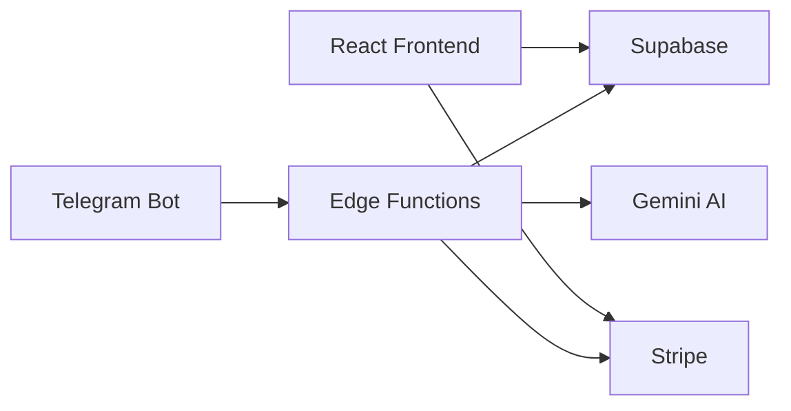

# 🔍 Análise Detalhada do Sistema Gasto Certo (Zaq)

**Data:** 09/12/2024  
**Última Revisão:** Após refatoração dos hooks  
**Perspectivas:** Dev Sênior | Analista de Sistemas | Product Manager | Designer UX | Marketing Digital

---

## 🎯 Resumo Executivo

O **Gasto Certo (Zaq)** é um sistema de gestão financeira pessoal e familiar com integração Telegram e IA (Gemini 2.5). Sistema funcional com melhorias recentes em modularização.

| Perspectiva | Nota | Principais Pontos |
|-------------|------|-------------------|
| Desenvolvedor Sênior | 7.9/10 | Hooks refatorados ✅, webhook ainda monolítico 🔴 |
| Analista de Sistemas | 8.2/10 | Arquitetura sólida, RLS completo, 38 migrations |
| Product Manager | 8.5/10 | Produto diferenciado (único no Telegram BR) |
| Designer UX | 7.8/10 | Shadcn/UI moderno, faltam micro-interações |
| Marketing Digital | 7.0/10 | SEO básico, falta vídeo demo e conteúdo |

---

## 👨‍💻 DESENVOLVEDOR SÊNIOR

### Stack Tecnológico ✅ Excelente

```
Frontend: React 18 + TypeScript + Vite + TailwindCSS + Shadcn/UI
Backend:  Supabase (PostgreSQL + Edge Functions + Auth + Realtime)
AI:       Google Gemini 2.5 Flash (NLP + Transcrição de áudio)
Payments: Stripe (checkout + portal + webhooks)
```

### Métricas do Código (Atualizado)

| Categoria | Arquivos | Tamanho | Status |
|-----------|----------|---------|--------|
| Páginas | 20 | ~316KB | 🟢 Normal |
| Componentes | 69 (50 UI + 19 custom) | ~150KB | 🟢 Normal |
| Hooks | 18 | ~50KB | 🟢 **Refatorados** |
| Edge Functions | 16 | ~160KB | 🔴 Webhook crítico |
| Migrations | 38 | ~175KB | 🟢 Bem organizadas |

### ✅ Melhoria Recente: Refatoração dos Hooks

O `useSupabaseData.ts` foi dividido de **799 linhas** para **8 arquivos** modulares:

| Arquivo | Linhas | Responsabilidade |
|---------|--------|------------------|
| `useTransactions.ts` | 128 | CRUD transações + Realtime |
| `useAccounts.ts` | ~100 | Contas bancárias |
| `useCategories.ts` | ~90 | Categorias + keywords |
| `useBudgets.ts` | ~100 | Orçamentos mensais |
| `useGoals.ts` | ~80 | Metas financeiras |
| `useFinancialStats.ts` | ~100 | Estatísticas do dashboard |
| `useFinancialProfile.ts` | ~90 | Perfil do quiz financeiro |
| `useSupabaseData.ts` | 16 | Re-exports (compatibilidade) |

### 🔴 Problema Crítico: telegram-webhook/index.ts

| Métrica | Valor | Status |
|---------|-------|--------|
| Linhas | 3.141 | 🔴 Crítico |
| Tamanho | 127KB | 🔴 Muito grande |
| Funções | ~50+ | 🔴 Muitas responsabilidades |

**Estrutura Sugerida:**

```
supabase/functions/telegram-webhook/
├── index.ts           (< 100 linhas - roteamento)
├── commands/
│   ├── financial.ts   (/saldo, /resumo, /extrato)
│   ├── goals.ts       (/metas)
│   ├── context.ts     (/p, /g, /contexto)
│   └── admin.ts       (/ajuda, /start)
├── handlers/
│   ├── message.ts     (texto natural)
│   ├── callback.ts    (botões inline)
│   └── audio.ts       (transcrição)
├── services/
│   ├── nlp.ts         (parser de transações)
│   └── transcription.ts
└── utils/
    ├── formatters.ts  ✅ (já existe)
    └── telegram-api.ts ✅ (já existe)
```

### 🟡 Pontos de Atenção

| Item | Status | Observação |
|------|--------|------------|
| TypeScript | ✅ | 100% do projeto |
| React Query | ✅ | Bem implementado |
| Testes | ❌ | Nenhum teste encontrado |
| Rate Limiting | ❌ | Falta no webhook |
| Error Tracking | ❌ | Sem Sentry/similar |

---

## 🔍 ANALISTA DE SISTEMAS

### Arquitetura



### Modelo de Dados

| Domínio | Tabelas | RLS | Status |
|---------|---------|-----|--------|
| Autenticação | profiles, licenses | ✅ | Completo |
| Financeiro | transactions, accounts, categories, budgets, goals | ✅ | Completo |
| Família | family_groups, family_members, family_invites | ✅ | Completo |
| Telegram | telegram_integration, telegram_sessions | ✅ | Completo |
| Recorrentes | recurring_transactions | ✅ | Completo |
| LGPD | consent_log, data_deletion_requests | ✅ | Completo |

### Integrações

| Sistema | Status | Completude |
|---------|--------|------------|
| Telegram Bot | ✅ Funcionando | 90% |
| Gemini AI (NLP) | ✅ Funcionando | 95% |
| Gemini AI (Áudio) | ✅ Funcionando | 95% |
| Stripe | ⚠️ Configurado | 80% |
| Notificações | ⚠️ Parcial | 60% |

### Segurança

| Aspecto | Status | Observação |
|---------|--------|------------|
| RLS em todas tabelas | ✅ | Excelente |
| Autenticação JWT | ✅ | Supabase Auth |
| CORS configurado | ✅ | Headers presentes |
| Variáveis de ambiente | ✅ | `.env` no `.gitignore` |
| LGPD Compliance | ✅ | Consentimento + exclusão |
| Rate Limiting | ❌ | Implementar urgente |
| Input Validation | ⚠️ | Zod parcial |

---

## 📈 PRODUCT MANAGER

### Posicionamento Único

> "O único assistente financeiro brasileiro no Telegram com IA"

### Análise Competitiva

| Concorrente | Canal | Preço Entry | Família | Diferenciais |
|-------------|-------|-------------|---------|--------------|
| ZapGastos | WhatsApp | R$ 9,90 | Até 5 | Simples |
| GranaZen | WhatsApp | R$ 17,91 | Sim | Planilhas |
| Poupa.ai | WhatsApp | R$ 15,92 | Sim | IA básica |
| **Zaq** | Telegram | R$ 14,90 | Até 6 | IA Gemini + Áudio |

### Estrutura de Planos

| Plano | Preço Mensal | Preço Anual | Principais Limites |
|-------|--------------|-------------|-------------------|
| Gratuito | R$ 0 | R$ 0 | 30 tx/mês, 1 conta, trial 7 dias |
| Pessoal | R$ 14,90 | R$ 143 | Ilimitado |
| Família | R$ 24,90 | R$ 239 | Até 6 membros |

### Funcionalidades

#### ✅ Implementadas (MVP+)
- Transações CRUD + Realtime
- Contas bancárias ilimitadas
- Categorias com auto-learn (keywords)
- Orçamento por categoria
- Metas financeiras
- Transações recorrentes
- Telegram Bot (texto + áudio)
- Sistema de Família com roles
- Quiz de saúde financeira
- Dashboard com gráficos
- Relatórios e exportação

#### 🟡 Parcialmente Implementadas
- Stripe (funcional, falta testes e2e)
- Notificações Telegram (básicas)
- Cartões de crédito (faturas)

#### ❌ Não Implementadas (Roadmap)
- Resumo diário matinal
- OCR para notas fiscais
- Sincronização Google Sheets
- Programa de afiliados
- Multi-idioma (i18n)

### Roadmap Sugerido

**Sprint 1 (1-2 semanas): Estabilização**
- [ ] Refatorar `telegram-webhook/index.ts`
- [ ] Configurar testes (Vitest)
- [ ] Rate limiting no webhook

**Sprint 2 (3-4 semanas): Monetização**
- [ ] Testes e2e do fluxo Stripe
- [ ] Melhorar onboarding
- [ ] Métricas de conversão

**Sprint 3 (5-6 semanas): Engajamento**
- [ ] Resumo diário matinal
- [ ] Notificações de orçamento
- [ ] Vídeo demonstrativo

---

## 🎨 DESIGNER UX

### Pontos Fortes ✅

| Aspecto | Status | Observação |
|---------|--------|------------|
| Design System | ✅ | Shadcn/UI + Radix |
| Dark Mode | ✅ | Bem implementado |
| Responsividade | ✅ | Mobile-first no Dashboard |
| Componentização | ✅ | 50+ componentes UI |
| Skeleton Loading | ✅ | Presente em listas |

### Biblioteca de Componentes UI

**50 componentes Shadcn/UI:**
- Formulários: Button, Input, Select, Checkbox, Switch, etc.
- Layout: Card, Dialog, Sheet, Tabs, Accordion
- Feedback: Toast, Alert, Skeleton, Progress
- Navegação: Sidebar (24KB), Navigation Menu, Breadcrumb

### Pontos de Melhoria 🟡

| Área | Problema | Sugestão |
|------|----------|----------|
| Landing Page | Sem vídeo demo | Adicionar vídeo de 60s |
| Mobile | Sem bottom navigation | Implementar tab bar |
| Onboarding | Pode ser pulado | Tornar obrigatório |
| Micro-animações | Poucas | Adicionar em cards e transições |
| Empty States | Básicos | Ilustrações + CTAs |

### Páginas por Tamanho

| Página | Linhas | Complexidade |
|--------|--------|--------------|
| FamilySettings.tsx | 39KB | 🔴 Muito grande |
| PrivacyPolicy.tsx | 32KB | 🟡 Conteúdo estático |
| RecurringTransactions.tsx | 30KB | 🟡 Muita lógica |
| Transactions.tsx | 24KB | 🟢 Adequado |
| Planos.tsx | 21KB | 🟢 Adequado |
| Landing.tsx | 20KB | 🟢 Adequado |
| Dashboard.tsx | 11KB | 🟢 Bom |

### Fluxos Críticos

**1. Registro → Dashboard**
```
Landing → Auth → Onboarding (opcional) → Dashboard
                      ↓
              Quiz Financeiro (opcional)
```
> ⚠️ Problema: Usuários pulam onboarding

**2. Vinculação Telegram**
```
Settings → Gerar Código → Copiar → Telegram → /start → Colar código
```
> ⚠️ Problema: Muitos passos manuais. Sugestão: Deep link

---

## 📣 MARKETING DIGITAL

### SEO Atual

| Elemento | Status | Observação |
|----------|--------|------------|
| Title Tag | ✅ | "Zaq - Boas Contas | Controle Financeiro Inteligente" |
| Meta Description | ✅ | 160 chars, inclui keywords |
| Open Graph | ✅ | Configurado |
| Twitter Cards | ✅ | summary_large_image |
| Favicon | ⚠️ | URL externa (GPT-generated) |
| Canonical URL | ❌ | Não configurado |
| Sitemap.xml | ❌ | Não existe |
| robots.txt | ❌ | Não existe |

### Landing Page

| Seção | Status | Observação |
|-------|--------|------------|
| Hero | ✅ | Headline clara, CTA visível |
| Social Proof | ⚠️ | "+500 famílias" (placeholder) |
| Features | ✅ | 4 cards bem descritos |
| Demonstração Telegram | ✅ | Mockup de conversa |
| Proposta de Valor | ✅ | Seção "Propósito" (cristão) |
| Pricing | ✅ | 4 planos, toggle anual |
| Trust Signals | ✅ | Criptografia, garantia, cancelamento |
| Footer | ✅ | Links, legal, valores |

### Pontos de Melhoria 🟡

| Item | Prioridade | Impacto |
|------|-----------|---------|
| Vídeo de demonstração | Alta | Conversão +30% |
| Depoimentos reais | Alta | Confiança |
| Blog/Conteúdo | Média | SEO orgânico |
| FAQ com Schema | Média | Rich snippets |
| Sitemap/robots.txt | Média | Indexação |
| Analytics (GA4) | Alta | Métricas |
| Pixel Facebook/Google | Média | Remarketing |
| Favicon próprio | Baixa | Branding |

### Copy da Landing Page

**Pontos Fortes:**
- Headline emocional: "Simplifique o Controle Financeiro da sua **Família**"
- Benefícios claros vs features
- Conexão com valores cristãos (diferenciação)
- CTAs consistentes ("Começar Grátis")

**Pontos a Melhorar:**
- "Nova IA 2.0 disponível" - vago, especificar
- "+500 famílias" - número real ou remover
- "Ver Como Funciona" - botão sem ação

### Estratégia de Conteúdo Sugerida

1. **Blog** (SEO orgânico)
   - "Como controlar gastos pelo Telegram"
   - "Finanças para casais cristãos"
   - "Orçamento familiar: guia completo"

2. **YouTube/TikTok**
   - Tutoriais curtos do bot
   - Cases de famílias usando

3. **Email Marketing**
   - Onboarding sequence
   - Weekly financial tips
   - Upgrade prompts

---

## 📊 SCORECARD FINAL

| Categoria | Peso | Nota | Pontuação | Trend |
|-----------|------|------|-----------|-------|
| Arquitetura | 15% | 8.5/10 | 1.28 | ⬆️ |
| Segurança | 20% | 8.0/10 | 1.60 | — |
| Qualidade de Código | 20% | 7.8/10 | 1.56 | ⬆️ +0.3 |
| Funcionalidades | 20% | 9.0/10 | 1.80 | — |
| Manutenibilidade | 10% | 6.5/10 | 0.65 | ⬆️ +1.0 |
| UX/UI | 10% | 7.8/10 | 0.78 | — |
| Marketing/SEO | 5% | 7.0/10 | 0.35 | — |
| **TOTAL** | | | **8.02/10** | ⬆️ +0.37 |

### Comparativo

| Versão | Data | Nota | Mudanças |
|--------|------|------|----------|
| 1.0 | 08/12/2024 | 7.65 | Análise inicial |
| **1.1** | **09/12/2024** | **8.02** | Hooks refatorados (+0.37) |

---

## 🎯 Recomendações Priorizadas

### 🔴 Alta Prioridade (Esta semana)

1. **Refatorar `telegram-webhook/index.ts`**
   - Dividir 3.141 linhas em módulos
   - Seguir estrutura sugerida
   - Impacto: Manutenibilidade +2 pontos

2. **Implementar Rate Limiting**
   - Prevenir abuse do webhook
   - Limite: 60 req/min por usuário

3. **Configurar Testes**
   - Vitest para hooks
   - 10 testes críticos mínimos

### 🟡 Média Prioridade (Próximas 2 semanas)

4. **Vídeo de Demonstração**
   - 60 segundos mostrando Telegram
   - Embed na landing page

5. **Melhorar Onboarding**
   - Tornar primeiros 3 passos obrigatórios
   - Deep link para Telegram

6. **Analytics**
   - Google Analytics 4
   - Eventos de conversão

### 🟢 Baixa Prioridade (Próximo mês)

7. Sitemap.xml e robots.txt
8. Blog com 3 posts iniciais
9. Depoimentos reais
10. i18n (inglês)

---

## 📞 Conclusão

> **BOM e EVOLUINDO** 🚀

O sistema passou de 7.65 para **8.02** após a refatoração dos hooks. O principal gargalo agora é o `telegram-webhook/index.ts` com 3.141 linhas. Após essa refatoração, a nota de manutenibilidade subirá significativamente.

**Próximo passo crítico:** Refatorar o webhook do Telegram.

---

*Análise gerada em 09/12/2024 às 06:45 BRT*
